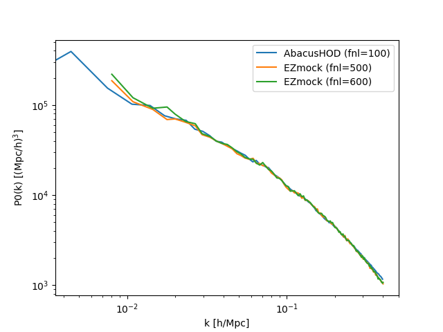

# covariance mocks with PNG initial conditions

Here we discuss about the covariance mocks for PNG measurements. 
Currently we focus on local PNG only.

## EZmock with PNG initial conditions

We replace the Zeldovich approximation (ZA) solver in EZmock with a PNG initial condition generator based on 2LPTic code (Scoccimarro et al. 2012). We modified the code to print the displacement fields, which is our input to EZmock.

Zhuoyang found that we may need to calibrate the $f_{rm NL}$ value in the initial condition generator to match the large-scale power spectrum boost due to PNG. The reason is still unclear, maybe due to that 2LPT lost some PNG information compared to the full Nbody simulations.

But this effect has not been tested at high redshift. 
For example, in my work, I found that at z=0.95, the EZmock calibreated to the AbacusPNG QSO mock needs very high $f_{rm NL}$ value (1500) to match the AbacusPNG $f_{\rm NL}=100$ mock. While at z=3, $f_{rm NL}=1500$ seems too high to work.
